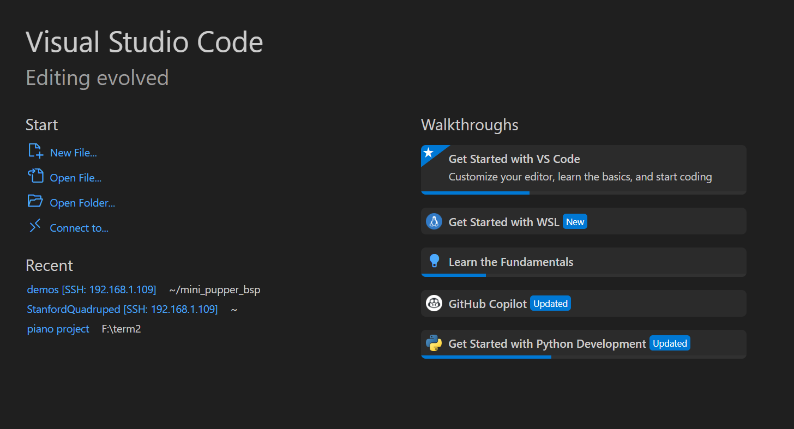
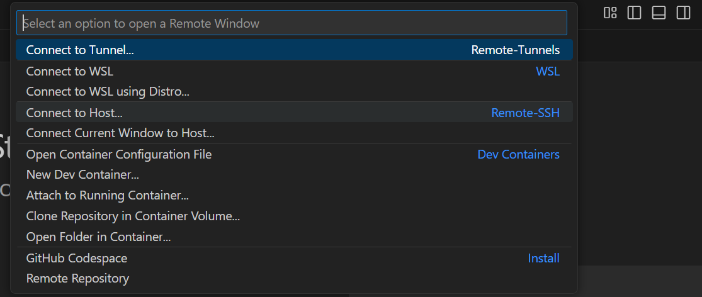
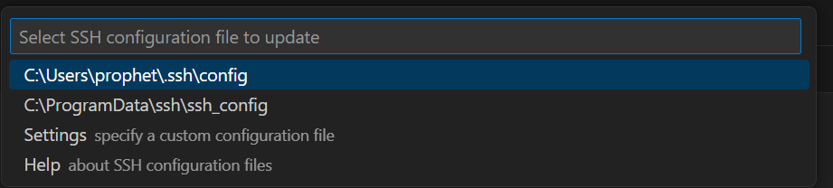
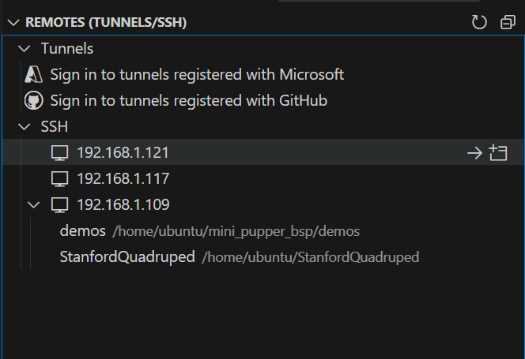
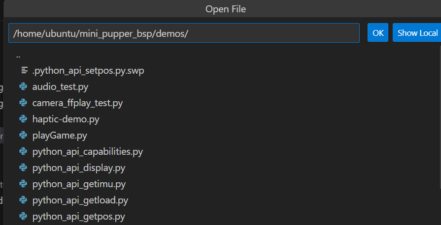

# HOW TO USE VS CODE TO CONNECT MP

1. Press and hold the start button at the bottom of the mini pupper for 3-5 seconds to open the mini pupper. The user can see the IP address written on the face of the mini pupper.
 
2. Open VS code and download remote SSH.

3. Then on the initial page the user can see the *connect to remote development workspaces button*. Clicking it we can connect VS code to external MP via remote-SSH as long as we type a sentence in the format *SSH ubuntu@192.168.1.117* (replace with the IP address on the specific mini pupper.) We are instructed to select SSH configuration file to update, and I choose the first path to establish connection.

4. After successfully creating the IP address for the remote connection, we can find the new IP address when we open the remote explorer on the left side. Press the button “connect in new window”. Press Linux and enter the password “mangdang”, then we can successfully establish connection.
   
   
5. Then choose “mini pupper_bsp/demos/python_api_setpos.py” to open the code file. Then we can modify action instructions on the code.
   

the instruction works well, but I think it could add something more

# Some of my suggestion to improve ig

- Maybe add remoting from the user terminal (Windows powershell Mac's Terminal etc)
- could add image whem mni pupper displaying IP address
- maybe let the user bash some demos to show that they successfully conneect with pupper e.g. let use './playsomebeepingsound.py' 
- the exit command when you wanted to stop remote
